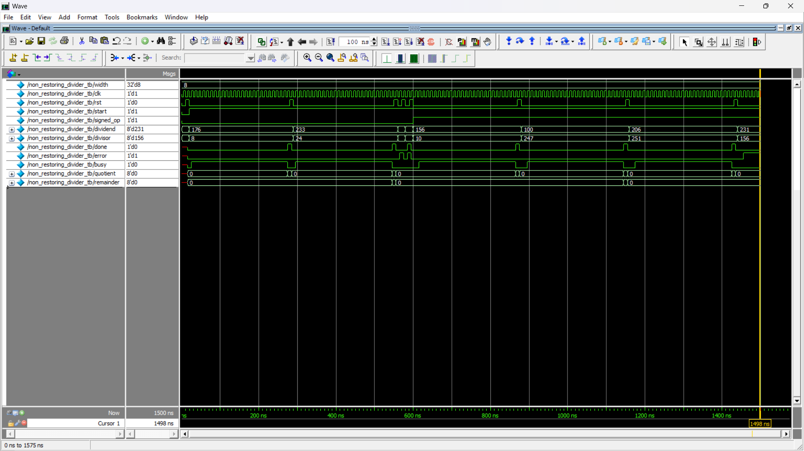
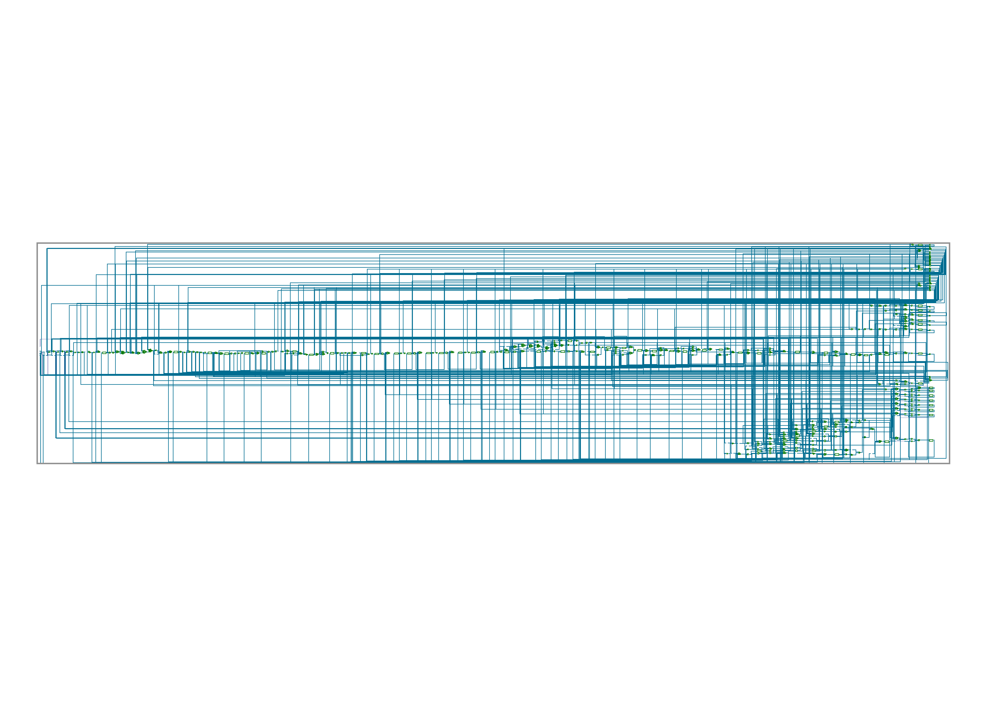

# Parameterized Non-Restoring Divider Design and Verification

This project implements a parameterizable **Non-Restoring Divider** in Verilog, capable of handling both signed and unsigned division. The design supports a fully FSM-controlled sequential approach and performs accurate quotient and remainder calculations with error detection (like divide-by-zero).

## 🔧 Project Structure

```
.
├── rtl/        # RTL source code for the Divider
├── tb/         # Testbenches covering signed and unsigned divisions
├── sim/        # Simulation outputs and logs
├── lint/       # SpyGlass linting reports
├── synth/      # Synopsys Design Compiler synthesis reports and gate-level netlist
└── README.md   # Project documentation
```

## 📂 RTL Design

- **File**: `rtl/non_restoring_divider.v`
- **Description**: Implements a divider with the following features:
  - Parameterized data width (`width`)
  - Parameterized iteration counter width (`counter_width`)
  - Handles both **signed** and **unsigned** operations
  - FSM-controlled stages: `reset`, `sign_detection`, `shift`, `operate`, `decide`, and `finish`
  - Detects division by zero and outputs an error flag
  - Outputs both quotient and remainder

## 🧪 Testbench

- **Directory**: `tb/`
- **Coverage**:
  - Verifies unsigned division for normal, edge, and error conditions
  - Verifies signed division with positive/negative combinations
  - Tests divide-by-zero case
- **Simulation Tool**: SIEMENS QuestaSim

## 📊 Linting

- **Tool**: Synopsys VC SpyGlass
- **Directory**: `lint/`
- **Report**: Ensures clean RTL with no unused logic, correct coding style, and synthesis readiness

## 🏗️ Synthesis

- **Tool**: Synopsys Design Compiler
- **Directory**: `synth/`
- **Output Files**:
  - `non_restoring_divider_netlist.v`: Synthesized gate-level netlist
  - `schematic.png`: Post-synthesis schematic for design clarity
- **Notes**: Synthesized targeting standard cell library `lsi_10k.db`

## 📝 How to Run Simulations

1. Navigate to the `tb/` directory.
2. Use `QuestaSim` simulator with the provided `Makefile`:
   ```bash
   make all
   ```
3. View output waveforms or logs in the `sim/` folder.

## ✅ Deliverables Summary

| Deliverable                     | Status          |
|---------------------------------|-----------------|
| RTL Divider Design              | ✅ Completed     |
| Testbench with Signed/Unsigned | ✅ Completed     |
| Linting via SpyGlass            | ✅ Passed        |
| Synthesis via Design Compiler   | ✅ Completed     |
| Gate-Level Netlist              | ✅ Available     |
| Schematic Diagram               | ✅ Available     |

## 🖼️ Screenshots





## 📌 Author

- Name: Hithaishi S R
- Profile: [LinkedIn](https://www.linkedin.com/in/hithaishisr)

## 📜 License

This project is intended for educational and learning purposes. Feel free to adapt and build upon it for your use.
