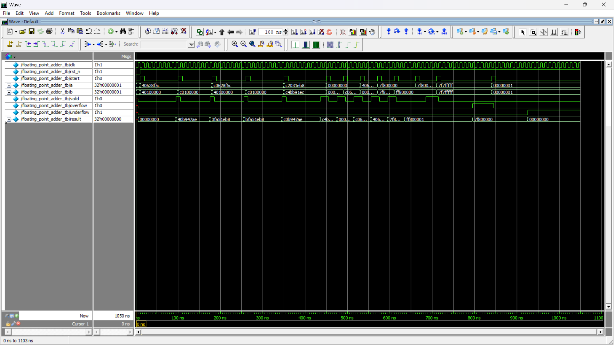
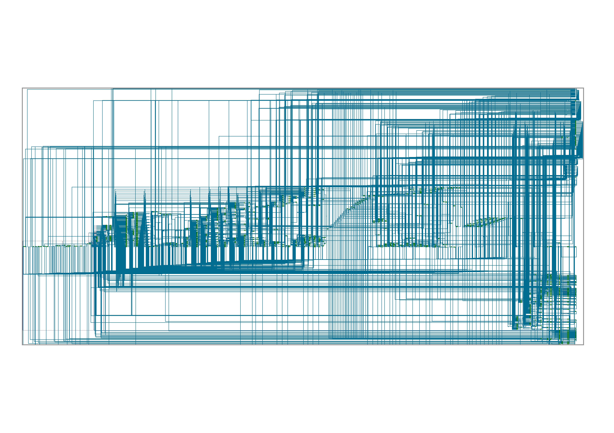

# IEEE 754 32-bit Floating Point Adder – FSM-Based Design

This project implements a 32-bit IEEE 754-compliant Floating Point Adder using Verilog. The design is fully FSM-driven and handles all edge cases, including normalization, rounding, overflow, underflow, zero, infinity, and NaN.

## 🔧 Project Structure

```
.
├── rtl/        # RTL source code for Floating Point Adder
├── tb/         # Testbenches with extensive coverage
├── sim/        # Simulation outputs and waveform dumps
├── lint/       # Linting reports (SpyGlass / Verilator)
├── synth/      # Synthesis reports and netlist
└── README.md   # Project documentation
```

## 📂 RTL Design

- **File**: `rtl/floating_point_adder.v`
- **Description**:
  - Adds two 32-bit IEEE 754 floating-point numbers.
  - FSM-based design with states:
    - `STATE_IDLE`
    - `STATE_UNPACK_INPUTS`
    - `STATE_CHECK_EXCEPTIONS`
    - `STATE_EXCEPTION_DONE`
    - `STATE_ADD_OR_SUB`
    - `STATE_HANDLE_CARRY`
    - `STATE_NORMALIZE_SHIFT`
    - `STATE_NORMALIZE_MANT`
    - `STATE_PACK_OUTPUT`
  - Handles:
    - Different sign operands (subtraction)
    - Same sign operands (addition)
    - Normalization and exponent adjustment
    - Special values: NaN, Inf, Zero
    - Overflow and underflow detection

## 🧪 Testbench

- **Directory**: `tb/`
- **Features**:
  - Tests for all input combinations:
    - Positive and negative operands
    - Operand A or B = 0
    - Both operands = 0
    - Infinity and NaN combinations
    - Overflow and underflow corner cases
- **Tool**: QuestaSim

## 📊 Linting

- **Tool**: Synopsys VC SpyGlass
- **Directory**: `lint/`
- **Checks**:
  - FSM completeness
  - Implicit state transitions
  - Synthesis-safe RTL practices

## 🏗️ Synthesis

- **Tool**: Synopsys Design Compiler
- **Directory**: `synth/`
- **Output**:
  - `floating_point_adder_netlist.v`
  - `schematic.png`
- **Target Library**: `lsi_10k.db` or any standard 65nm library

## 📝 How to Simulate

1. Go to `tb/` directory.
2. Use `Makefile` with simulator (QuestaSim):
   ```bash
   make all
   ```
3. View output waveforms or logs in the `sim/` folder.

## ✅ Deliverables Summary

| Deliverable                        | Status      |
|------------------------------------|-------------|
| RTL Floating Point Adder           | ✅ Complete |
| Testbench with Corner Cases        | ✅ Covered  |
| Linting (No Major Warnings)        | ✅ Passed   |
| Synthesis (Gate-level Netlist)     | ✅ Done     |

## 🖼️ Screenshots





## 👤 Author

- **Name**: Hithaishi S R  
- **Profile**: [LinkedIn](https://www.linkedin.com/in/hithaishisr)

## 📜 License

This project is open for educational and non-commercial use. Use it to learn, build, or expand your digital design skills!
