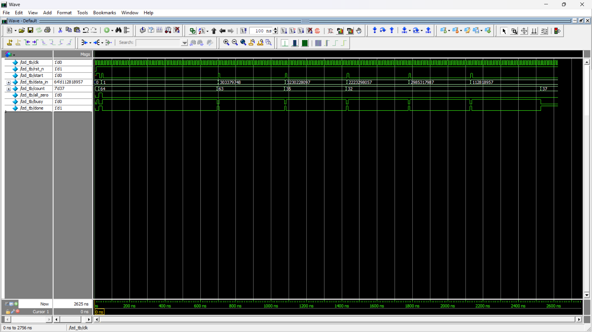
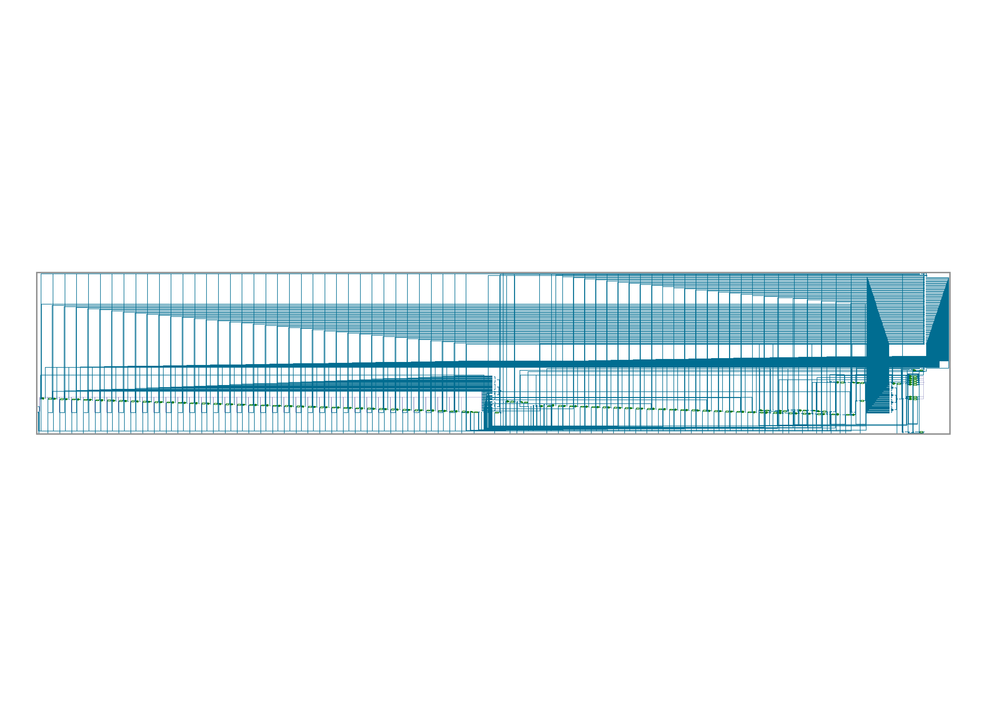

# Leading Zero Detector – FSM-Based Design

This project implements a **parameterized FSM-based 64-bit Leading Zero Detector (LZD)** in Verilog. The design counts the number of leading zeros in a binary input word using a sequential, low-power architecture.

## 🔧 Project Structure

```
.
├── rtl/        # RTL source code for Leading Zero Detector
├── tb/         # Testbench for simulation
├── sim/        # Simulation outputs and waveform dumps
├── lint/       # Linting reports (SpyGlass)
├── synth/      # Synthesis reports and netlist
└── README.md   # Project documentation
```

## 📂 RTL Design

- **File**: `rtl/lzd.v`
- **Description**:
  - Parameterized FSM-based Leading Zero Detector
  - Parameters:
    - `width = 64` — Input width
    - `count_width = 7` — Count output width
  - FSM States:
    - `IDLE`
    - `CHECK_BIT`
    - `DONE`
  - Inputs:
    - `clk`, `rst_n`, `start`, `data_in[width-1:0]`
  - Outputs:
    - `count[count_width-1:0]`: Number of leading zeros
    - `all_zero`: High if all bits are 0
    - `done`: High when operation completes
    - `busy`: High while detector is processing
  - Functional Highlights:
    - Shifts left and increments counter until the MSB becomes 1
    - Handles all-zero edge case (`count = width`, `all_zero = 1`)
    - FSM-based control allows sequential, low-power operation

## 🧪 Testbench

- **Directory**: `tb/`
- **File**: `tb/lzd_tb.v`
- **Features**:
  - Stimulates the DUT with various edge and random cases
  - Handles:
    - `data_in = 0` (all-zero)
    - `data_in = 1` (LSB only set)
    - Random 32-bit values zero-extended to 64-bit
  - Waits for the `done` signal before checking outputs
  - Logs results using `$display`

## 📊 Linting

- **Tool**: Synopsys VC SpyGlass
- **Directory**: `lint/`
- **Checks**:
  - FSM state coverage
  - Combinational logic safety
  - Synthesis-safe and clean RTL structure

## 🏗️ Synthesis

- **Tool**: Synopsys Design Compiler
- **Directory**: `synth/`
- **Output**:
  - `lzd_netlist.v`
  - `schematic.png`
- **Target Library**: `lsi_10k.db` or any standard 65nm library

## 📝 How to Simulate

1. Go to `tb/` directory.
2. Use `Makefile` with simulator (QuestaSim):
   ```bash
   make all
   ```
3. View output waveforms or logs in the `sim/` folder.

## ✅ Deliverables Summary

| Deliverable               | Status      |
|---------------------------|-------------|
| RTL LZD Design            | ✅ Complete |
| Testbench                 | ✅ Complete |
| Linting (No Major Warnings) | ✅ Passed |
| Synthesis (Gate-level Netlist) | ✅ Done |

## 🖼️ Screenshots





## 👤 Author

- **Name**: Hithaishi S R  
- **Profile**: [LinkedIn](https://www.linkedin.com/in/hithaishisr)

## 📜 License

This project is open for educational and non-commercial use. Use it to learn, build, or expand your digital design skills!
